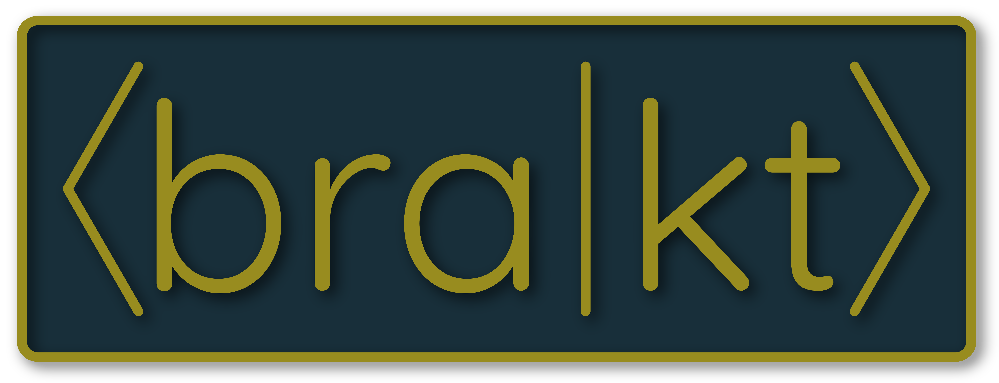

 

<table>
<tr>
<td></td>
<td>
<h1>bra-kt</h1>

A Kotlin/Multiplatform interface for quantum computing
</td>  
</tr>
</table>

## Features

- Common interface for building quantum circuits
- Interacts with the IBM Quantum API
- Compiles into JVM bytecode (Java), JS (JavaScript), or native binaries (Windows/Mac/Linux)

## Installation

Import the root project into IntelliJ. Current version supports JDK 11 Corretto with Gradle 7.3

## Goals

What am I trying to accomplish?

- Replace standard Python libraries with a pure Kotlin implementation
    - Python has many limitations:
        - Restricted to one runtime (Python)
        - Not type-safe, null-safe, etc.
        - Slow
        - Not very well adopted outside of data science
    - Kotlin has many improvements over Python:
        - Multiplatform projects (like bra-kt) can compile to the JVM, JS, or native libs; can interop with each backend
        - Type-safe, null-safe, etc.
        - Very fast, depends on the backend implementation
        - Each backend has its own plethora of use cases:
            - JVM: Desktop applications, servers
            - JS: Websites, servers
            - Native: Desktop applications, workstation tasks (think scientific research)
    - Reduce dependency on a single framework
- Replace fractured online quantum circuit builders
    - Each graphical circuit builder is specific to a certain company's hardware
    - Hard to learn/high entry barrier
    - Very uncommon to write programs this way because it's slow
- Lower the entry barrier for quantum
    - It's too hard to get started
    - Online resources, including free textbooks, have made it easier, but it's still extremely hard to learn
    - Provide more algorithm explanations and pre-built circuits for beginners
- If I have time, work on a _very_ basic simulator
    - Just a proof-of-concept that the hardware-agnostic circuit builder is easy to implement for specific platforms

Summary:

1. Fix the fractured quantum ecosystem with a multi-runtime, hardware-agnostic circuit builder
2. Make it easier for people to write quantum software

## Plans

<table>
<tr>
<th>Project</th>
<th>Details</th>
</tr>
<tr>
<td>Quantum circuit builder</td>
<td>

- Enum for all basic gates
    - Single-qubit gates are complete
    - Entanglement/CNOT, measurement operations needed

</td>
<tr>
<td>IBM Q Provider</td>
<td>

- Continue documenting API
    - Read through more Qiskit code
    - Use Chrome devtools more in the online circuit builder
    - Finish adding read-only endpoints
- Write QASM compiler from quantum circuit builder
    - Reverse-engineer QASM-related endpoints

</td>
</tr>
<tr>
<td>First-class support for JS backend</td>
<td>

- Support composing quantum circuits in JavaScript or TypeScript
    - Ideally, write a GUI in React to build circuits
    - Release to npm, test in Node.js
- Compile unified API module for JS backend
    - Implement `PropertyManager` for JS

</td>
</tr>
<tr>
<td>Basic simulator</td>
<td>

- Try to simulate basic quantum circuits on a Kotlin server
    - How? I have no clue how the math works
- Optimize heavily using a profiler
- Will this be a commercial product? If so, I need to buy IntelliJ Ultimate
- Kotlin/Native or Kotlin/JVM?
    - If, somehow, this application can be CUDA-accelerated, look into Kotlin/Native interop with libs/DLLs
    - Otherwise, Kotlin/JVM is just as easy (not in a math sense, though)

</td>
</tr>
</table>

## Inspired By

- [Qiskit](https://github.com/Qiskit)
- [ssuukk/Qotlin](https://github.com/ssuukk/Qotlin)
- [Antimonit/Quantum](https://github.com/Antimonit/Quantum)
