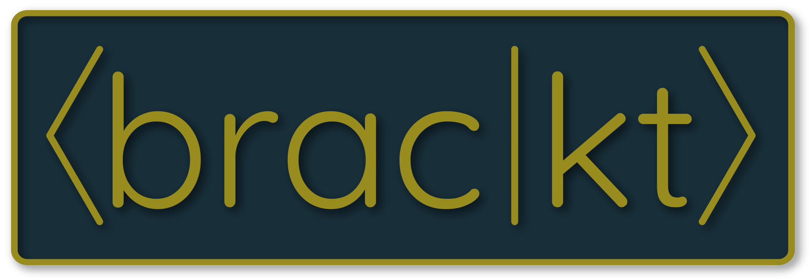

[/main?label=Code%20Linting&cacheSeconds=1)](https://github.com/TheNewJavaman/brac-kt/actions/workflows/linting.yml)
[/main?label=Tests&cacheSeconds=1)](https://github.com/TheNewJavaman/brac-kt/actions/workflows/tests.yml)
[/main?label=Docs&cacheSeconds=1)](https://javaman.net/brac-kt)
[](https://jitpack.io/#net.javaman.brac-kt/brac-kt)
[](https://jitpack.io/#net.javaman.brac-kt/brac-kt)
[](https://www.npmjs.com/~thenewjavaman)
[](https://github.com/TheNewJavaman/brac-kt)
<table>
<tr>
<td></td>
<td>
<h1>brac-kt</h1>

A Kotlin/Multiplatform interface for quantum computing
</td>  
</tr>
<tr>
<td colspan=2 align="center">
<i>Named after bra-ket quantum notation (with "kt" for Kotlin), pronounced "bracket"</i>
</td>
</tr>
</table>

## Support

Write quantum circuits in any major language:

<table>
<tr>
<th>Java Virtual Machine</th>
<th>JavaScript Runtimes (Browser, Node.js)</th>
<th>Native Platforms (Windows, Linux)</th>
</tr>
<tr>
<td>

- Java
- Kotlin
- Groovy
- Scala

</td>
<td>

- JavaScript
- TypeScript
- Kotlin
- CoffeeScript

</td>
<td>

- C
- C++
- C#
- Kotlin

</td>
</tr>
</table>

## Installation

The brac-kt API will be included with any providers you install.

### Gradle (JVM)

Add to `build.gradle.kts`:

```kotlin
repositories {
    mavenCentral()
    maven {
        url = uri("https://jitpack.io")
    }
}

dependencies {
    implementation("net.javaman.brac-kt:brac-kt-ibmq-provider")
}
```

### npm (JS)

Install via `npm`:

```shell
npm i @thenewjavaman/brac-kt-ibmq-provider
```

## Examples

### Kotlin (JVM)

```kotlin
object Application {
    init {
        BracKtApi.addInjections()
        IbmqProvider.addInjections()
    }

    private val propertyManager: PropertyManager by injection()
    private val ibmqProvider: IbmqProvider by injection()

    @JvmStatic
    fun main(args: Array<String>) {
        val n = 3
        val qc = QuantumCircuit(name = "Example Superposition", numQubits = 3) {
            repeat(n) { h(qubit = it) }
            repeat(n) { measure(qubit = it, bit = it) }
        }

        val apiToken: String = propertyManager["IBMQ_API_TOKEN"]
        ibmqProvider.logInSync(apiToken)
        ibmqProvider.selectNetworkSync()
        ibmqProvider.selectDeviceSync()
        ibmqProvider.runExperimentAndWaitSync(qc)
    }
}
```

### Java (JVM)

```java
public class Application {
    static {
        BracKtApi.addInjections();
        IbmqProvider.addInjections();
    }

    private static final IbmqProvider ibmqProvider = new IbmqProvider();

    public static void main(String[] args) {
        int n = 3;
        QuantumCircuit qc = new QuantumCircuit("Example Superposition", n);
        for (int i = 0; i < n; i++) qc.h(i);
        for (int i = 0; i < n; i++) qc.measure(i, i);

        String apiToken = System.getenv("IBMQ_API_TOKEN");
        ibmqProvider.logInSync(apiToken);
        ibmqProvider.selectNetworkSync();
        ibmqProvider.selectDeviceSync();
        ibmqProvider.runExperimentAndWaitSync(qc);
    }
}
```

### TypeScript (JS)

```typescript
const app = async () => {
    bracKt.api.addInjections();
    bracKt.providers.ibmq.addInjections();

    const n = 3;
    const qc = new QuantumCircuit("Example Superposition", 3);
    for (let i = 0; i < n; i++) qc.h(i);
    for (let i = 0; i < n; i++) qc.measure(i, i);

    const ibmqProvider = new IbmqProvider();
    await ibmqProvider.logInAsync(process.env.IBMQ_API_TOKEN);
    await ibmqProvider.selectNetworkAsync();
    await ibmqProvider.selectDeviceAsync();
    await ibmqProvider.runExperimentAndWaitAsync(qc);
};
```

### C++ (Native)

```cpp
int main(int argc, char **argv) {
    BracKt *bracKt = libbrac_kt_ibmq_provider_symbols();
    bracKt->api.addInjections();
    bracKt->ibmq_provider.addInjections();

    int n = 3;
    QuantumCircuit qc = bracKt->api.quantum.QuantumCircuit.QuantumCircuit_("Example Superposition", n, n);
    for (int i = 0; i < n; i++) bracKt->api.quantum.QuantumCircuit.h(qc, i);
    for (int i = 0; i < n; i++) bracKt->api.quantum.QuantumCircuit.measure(qc, i, i);

    IbmqProvider ibmqProvider = bracKt->ibmq_provider.IbmqProvider.IbmqProvider();
    bracKt->ibmq_provider.IbmqProvider.logInSync(ibmqProvider, getenv("IBMQ_API_TOKEN"));
    bracKt->ibmq_provider.IbmqProvider.selectNetworkSync(ibmqProvider);
    bracKt->ibmq_provider.IbmqProvider.selectDeviceSync_(ibmqProvider, true, n);
    bracKt->ibmq_provider.IbmqProvider.runExperimentAndWaitSync(ibmqProvider, qc);
}
```

### Output

Every example outputs:

```
...
[...] [INFO ] Qubit outcomes:
[...] [INFO ]     0x0: 0.12890625 (132/1024)
[...] [INFO ]     0x1: 0.12792969 (131/1024)
[...] [INFO ]     0x2: 0.13769531 (141/1024)
[...] [INFO ]     0x3: 0.12695312 (130/1024)
[...] [INFO ]     0x4: 0.1171875 (120/1024)
[...] [INFO ]     0x5: 0.12109375 (124/1024)
[...] [INFO ]     0x6: 0.109375 (112/1024)
[...] [INFO ]     0x7: 0.13085938 (134/1024)
```

## Multiplatform Support

Integrating with other languages is seamless because brac-kt compiles into Java bytecode and JavaScript with TypeScript
definitions. Additionally, each platform has its own unique features; for example, Java and C/C++ have additional
synchronous API methods, whereas JavaScript has async/await versions. Kotlin on all platforms gets a few unique
features: a cross-platform property manager, dependency injection, and all-around cleaner syntax.

## Goals

What am I trying to accomplish?

### Summary

1. Write quantum circuits once, run on any hardware
2. Write quantum circuits in any major language using the same library (see Support above)
3. Simplify the quantum development process

### Details

1. Write quantum circuits once, run on any hardware
    - Each hardware provider provides their own tools, which can't cross-compile
    - Make it easy to test on different providers
    - Make it easy to switch providers when new features become available
2. Write quantum circuits in any major language using the same library
    - Replace standard Python libraries with a pure Kotlin/Multiplatform implementation
        - Python has many limitations:
            - Restricted to only the Python runtime
            - Not type-safe, null-safe; prone to runtime errors
            - Slow for non-C implementations; limits choices for big projects
            - Not well-adopted outside of data science
        - Kotlin fixes these issues:
            - Can run on the JVM, JS (browser or node.js), and native runtimes
            - Type-safe, null-safe; compile-time checks safeguard the development process
            - Very performant, especially for server applications on the JVM
            - Can run on any major runtime, so it can interop with most popular libraries
                - JVM: Desktop applications, servers
                - JS: Desktop apps, websites, sometimes servers (although they're less performant)
                - Native: Desktop applications, interop with legacy/low-level software, workstations tasks (scientific
                  research)
    - Easy to develop fullstack apps using one library in both frontend and backend
    - Provides more options for beginners, easier for people with non-data science backgrounds
3. Simplify quantum development process
    - Developers need to know too much math
        - Beginners or developers without science backgrounds should be able to build quantum applications
        - Provide advanced modules to abstract real-world problems into quantum circuits
    - Graphical circuit builders are generally restricted to just a few hardware providers; consider building a brac-kt
      GUI
    - In general, lower the entry barrier for quantum

## Plans

<table>
<tr>
<th>Project</th>
<th>Details</th>
</tr>
<tr>
<td>Native backend</td>
<td>

- Support C/C++ for Windows/MacOS/Linux
    - Should be easy thanks to Kotlin
    - Will interop with native libraries!
    - Compile into libs/DLLs
- Better support for native applications; write a program in C#/Swift and interface with brac-kt easily

</td>
</tr>
<tr>
<td>Other providers</td>
<td>

- Add support for other hardware manufacturers
    - Rigetti, GCP, AWS, Azure, etc.
    - Reverse-engineer APIs (double-check that bot accounts for testing aren't prohibited)
- JavaScript difficulties
    - JS will treat each hardware provider package's brac-kt API as a separate entity, meaning that circuits can't be
      shared across providers. This defeats the purpose of brac-kt!
    - Two solutions:
        - Don't bundle API with provider packages (preferred, but harder to figure out)
        - Build circuits using functions, where qc parameter has
          type `provider.a.Quantum Circuit | provider.b.QuantumCircuit` (it's fine, but not as good as the first
          solution)
- More important later
    - This feature will matter more when hardware providers are actually competing for market share
    - Right now, people still need to figure out the software. The hardware selection only matters because you're locked
      into the single hardware ecosystem, which is what brac-kt will solve

</td>
</tr>
<tr>
<td>Better documentation</td>
<td>

- In addition to the [dokka docs](https://javaman.net/brac-kt), write better documentation for utils, hardware
  providers, examples, macros, etc.

</td>
</tr>
<tr>
<td>Advanced modules</td>
<td>

- Build modules that abstract regular problems into quantum circuits
- Read through more online courses, textbooks, etc. to learn about real-world applications and algorithms
- Make it easy for any developer to get started without having to know all the linalg math
- See if QCP can be implemented; that would be a good first step

</td>
</tr>
<tr>
<td>Basic simulator</td>
<td>

- Try to simulate basic quantum circuits on a Kotlin server
    - How? I have no clue how the math works
- Optimize heavily using a profiler
- Will this be a commercial product? If so, I need to buy IntelliJ Ultimate
- Kotlin/Native or Kotlin/JVM?
    - If, somehow, this application can be CUDA-accelerated, look into Kotlin/Native interop with libs/DLLs
    - Otherwise, Kotlin/JVM is just as easy (not in a math sense, though)

</td>
</tr>
</table>

## Inspired By

- [Qiskit](https://github.com/Qiskit)
- [ssuukk/Qotlin](https://github.com/ssuukk/Qotlin)
- [Antimonit/Quantum](https://github.com/Antimonit/Quantum)
