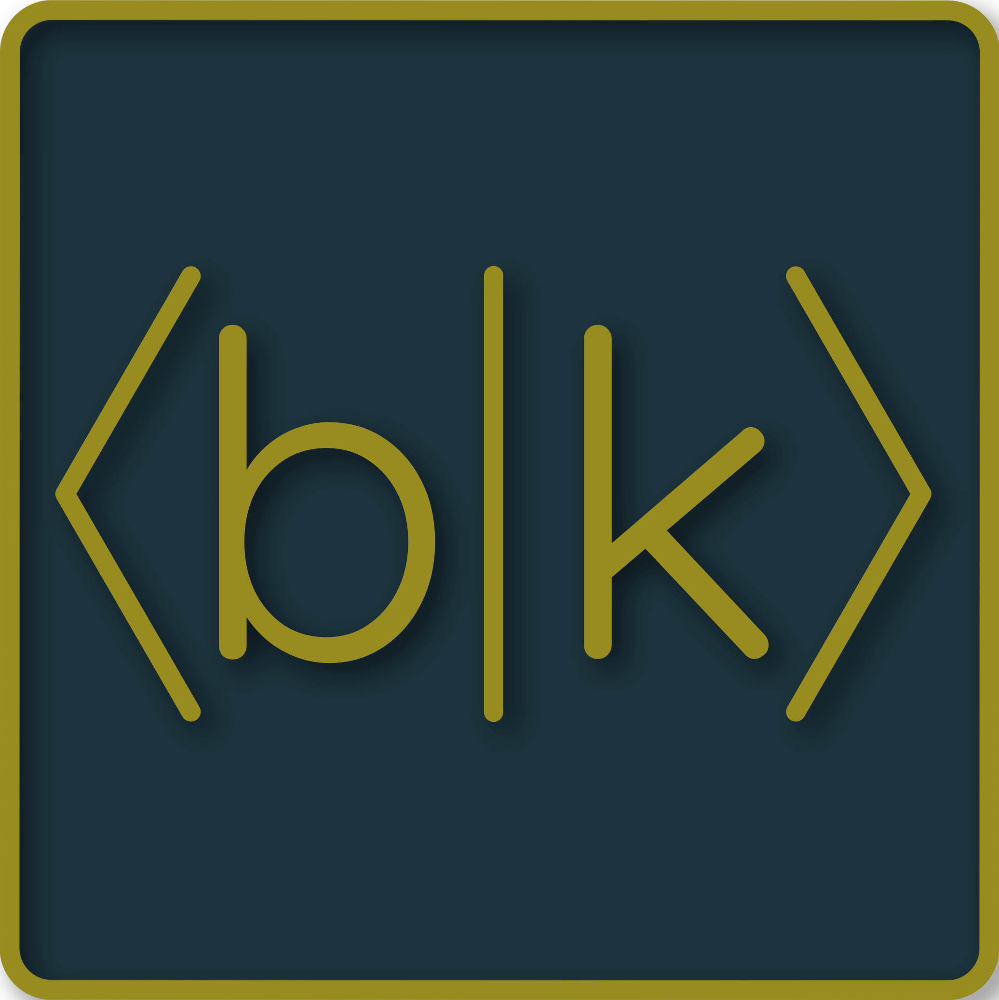

<h1>bra-kt</h1>

<table style="border-style: hidden!important;">
<tr>
<td>

</td>
<td>
A Kotlin/Multiplatform interface for quantum computing

- Common interface for building quantum circuits
- Interacts with the IBM Quantum API
- Compiles into JVM bytecode (Java), JS (JavaScript), or native binaries (Windows/Mac/Linux)

Named after bra-ket notation (but "kt" for Kotlin)
</td>
</tr>
</table>

## Installation

Import the root project into IntelliJ. Current version supports JDK 17.0.1 Corretto with Gradle 7.3

## Plans

- Finish internal quantum circuit representation
    - Enum for all basic gates
- Expand IBM Q Experience API integration
    - Continue documenting their API
    - Read through more Qiskit code 
    - Use Chrome devtools more in the online circuit builder
    - Finish adding read-only endpoints
    - Add compiler to generate IBM Q code for the API
- First-class support for JS backend
    - Goal: compose a quantum circuit within a JS/React app
    - Run on IBM Q or other providers
- Basic simulation
    - How? I have no clue
    - Goal: simulate basic quantum circuits on a Kotlin/JVM server
    - Optimize heavily using a profiler
    - Will this be a commercial product? If so, IntelliJ Ultimate is a no-go
    - Is Kotlin/Native faster than JVM?

## Inspired By

- [Qiskit](https://github.com/Qiskit)
- [ssuukk/Qotlin](https://github.com/ssuukk/Qotlin)
- [Antimonit/Quantum](https://github.com/Antimonit/Quantum)
